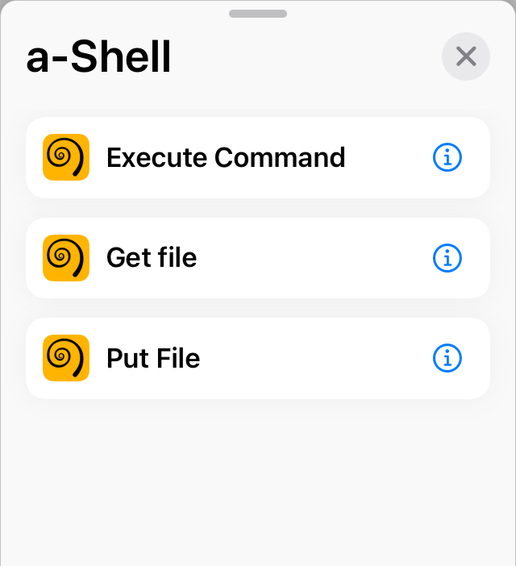
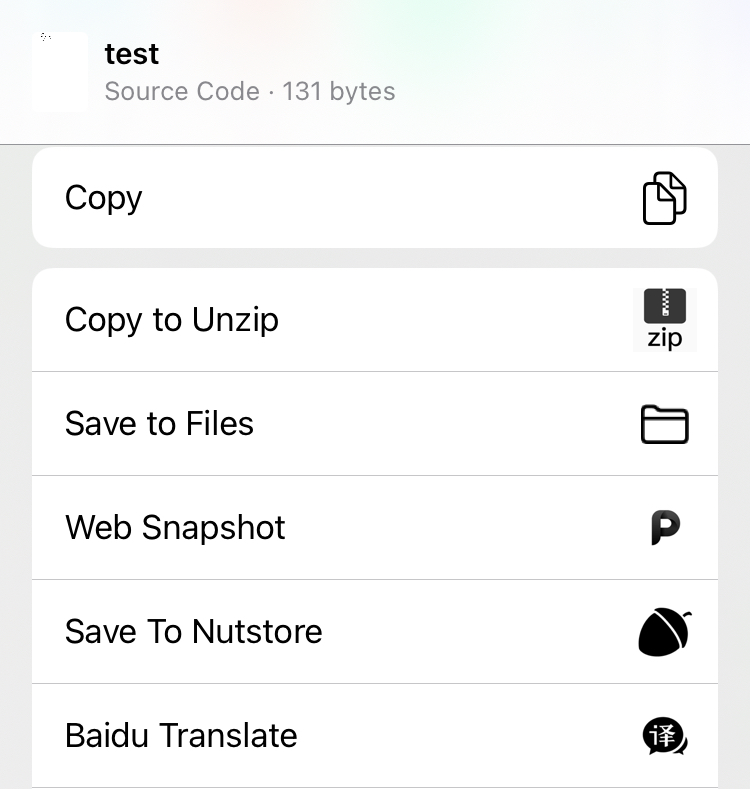
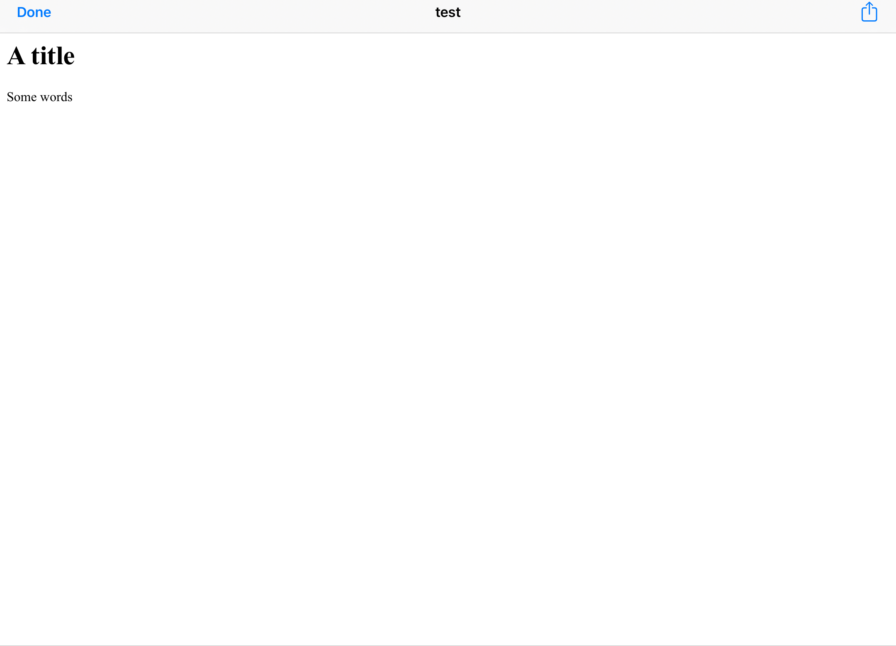

# A-Shell’s differences

In this article, we will talk about three topics: a-Shell’s features, limitations, and comparison with alternatives.

### Features

#### Shortcuts

This is one of the most welcomed functions of a-Shell. You can easily find the supported shortcuts on WorkFlow:

<figure><figcaption>
3 supported shortcuts: execute command, get file, and put file
</figcaption></figure>

With WorkFlow, what you can do with a shell has been greatly expanded.

By default, all files generated by shortcuts are stored at `~shortcuts/`.

#### Jump here and there

`z` command is built-in. With it you can easily jump between directories. What’s more, `z` is lighter and faster than `autojump`,  making it more suitable for a-Shell.

Adding bookmarks for dictionaries is also supported. Use `bookmark <name>` to add a bookmark for the current directory, `cd ~<name>` or `jump <name>` to jump to a bookmark, `showmarks` to show all current bookmarks, `renamemark` to revise the name of a bookmark and `deletemark` to delete it.

Any time you run `cd` without a parameter, you will be led to `~/Documents`, the initial directory. `cd -` will lead you to the last directory you were.

#### iOS/iPadOS interactions

A series of commands are provided to interact with other apps. Use `open <file>` to share a file to other apps:

<figure><figcaption>
The share interace
</figcaption></figure>

Use `view` to view a file rapidly, which may be helpful for PDF/HTML files or images.

<figure><figcaption>
An HTML page view
</figcaption></figure>

Use `play` command to play audio/video files.

<figure><figcaption>
An playing audio file
</figcaption></figure>

Although you can easily share a file *from* a-Shell via `open`, you can’t share a file *to* a-Shell directly. Fortunately, you can achieve that using shortcuts. As mentioned earlier, all files shared to a-Shell are saved at `~shortcuts/`. For another location, consider using a shortcut to execute a command automatically.

#### Access to the files

With `pickFolder` command, a-Shell can get access to another location on your iPhone/iPad, iCloud for example.

You can also read/write `~/Documents/` folder with Files. Switch to “My iPhone”/“My iPad”, and you’ll see the directory “a-Shell”. Attention files outside of `~/Documents/` can not be read.

### Limitations

Limitations mainly come from two aspects: those from Apple and those from the FSF.

#### Limitations from Apple

Due to Apple’s limitation, only those directories can be accessed by a-Shell: `~/Documents/`, `~/Library` and `~/tmp`, which has made a-Shell’s file structure uncommon. All user configuration files are stored at `~/Documents/` instead of `~`, and `$HOME` has been set to `~/Documents/` as well. The file structure has made building works, especially cross-compiling more complex, so it should be treated carefully.

Executable files are either native codes for iOS/iPadOS, or WebAssembly files. Due to Apple’s limitation, all native codes must be shipped with the App itself when releasing. To add a new command with native codes, you have to resign the developer certificate and release the whole app to App Store, and all users would receive the update then.

For native codes, many functions are unavailable on `arm64` for iOS, such as `fork()`, `exec()`, `system()`, etc. a-Shell emulates `fork()` and `exec()` for POSIX programs, which is not perfect but enough. WebAssembly is very limited as well, so that few commands can be compiled to WebAssembly.

`sudo` is also unavailable because of Apple’s limitations, so programs requring for a super-user privilege like `traceroute` does not work.

For jailbroken device users, it may be differences on a-Shell. For example, the entire file system would be able to read/write, which may cause problems. Do not hesitate to open an issue if you meet any of those!

#### Limitations from the FSF (Free Software Foundation)

There are actually many restrictions to use programs under GPL license. It may be not allowed to include GPL codes in the App Store distributions. You may have to ask for all contributors‘ permission, which may be very hard. Thus, it‘s suggested not including any GPL codes in a-Shell and try to find alternatives under BSD or other licenses. `bash`, `emacs`, `nano` and many other excellent programs can’t be included for this reason.

### Comparisons with alternatives

Here are comparisons between a-Shell and some alternatives. You may find which one suits you better here.

#### iSH

iSH is a Linux emulator for iOS/iPadOS, which uses syscall to translate Linux x86 commands. Of course, it’s interesting to use Alpine with an iOS device without jailbreaking.

With an emulating layer, iSH can do more things than a-Shell. You can run normal bash scripts, compile and run native binary codes or use `apk` to install a great number of packages. But attention iSH can’t to anyting you like. `node.js` and some important tools can’t be supported. What’s more, iSH works greatly slowlier and more unstable than a-Shell. It’s not very happy to wait 10 seconds for a simple Python script or a minute to clone a git repository, right?

#### Blink Shell

Blink is a remote device connecting tool for iOS/iPadOS, which now provides the best terminal experience on an iOS device. Blink Shell’s command function is based on `ios_system`, the same with a-Shell, so it’s listed here.

Blink Shell has an awesome appearance, an easy-to-use configure menu and a strong remote working ability, so it’s a recommended SSH/Mosh client for iOS/iPadOS. But Blink Shell itself is much weaker than a-Shell, where only basic UNIX commands are supported. You can’t even clone from a repository with it!

Blink Code is another welcomed function of Blink. Imagine coding with VSCode on an iPad everywhere! But attention it’s based on `vscode.dev`. Actually there is not a way to run a native VSCode on iPad yet.

Blink is not completely free of charge as well. Users of free plan will receive a “it’s time to become a pro” screen every day. They are forced to “rest“ for a while and have to pay for the advanced plan to remove it.

#### NewTerm

NewTerm is a terminal app for Apple devices. For iPhone or iPads, jailbreaking is required. It’s a real terminal emulator which can control the Apple Device completely, which is welcomed by jailbroken users. Of course, things it can do are much more than what a-Shell can do.

Besides functions, it has a tab-based interface and good font support. However, there are still some jailbroken users prefer a-Shell for its shortcuts or other features.

#### Termux

Termux is a terminal emulator for Android devices, supporting Linux environments for them. It uses `pkg` to manage packages.

Based on the Linux sub system, Termux has a strong ability to run a lot of programs, no matter `bash`, `zsh` or `fish`. What’s more, a number of developing tools are built-in, allowing users to build or debug. It can also use the API of Android, like reading the SMS box.

It’s even amazing to provide `proot` to allow users to install a complete Linux system here, and then almost everything can be done. On the contrary, the number of what an iOS device can do is much smaller.
