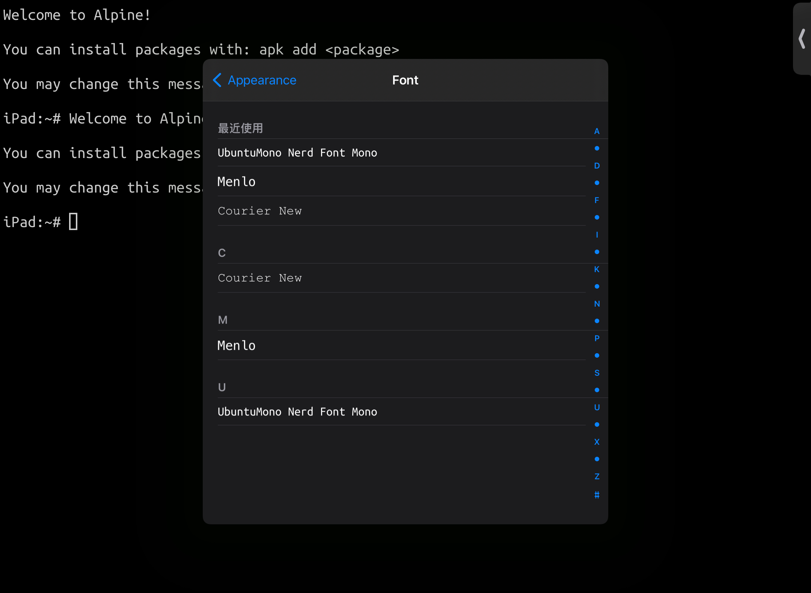

# Configure fonts, colors and the toolbar

`config` command is provided to allow users to configure the fonts, the color of the text and the background, and the toolbar.

### In a word

```
usage: config [-s font size][-n font name][-b background color][-f foreground 
color][-c cursor color][-dgprt]
```

* `-s font size`: change the size of the text
* `-n font name`: change the font
* `-b background color`: change the background color
* `-f foreground color`: change the text color
* `-c cursor color`: change the color of the cursor
* `-d`: do not save the changes and go back to the precious status
* `-g`: apply the change to all the open windows
* `-p`: save the change to apply it permanently
* `-r`: go back to the initial status: white background and black text
* `-t`: generate a toolbar configuration file

### Font

First you have to prepare your own console font manually. It’s recommended to use a nerd font from [https://www.nerdfonts.com](https://www.nerdfonts.com), which includes various icons. Download a font file to your device, then use an App like iFonts to have it installed.

Then you need to know your font’s exact name on your device. You may use another App that can see installed fonts, like iSH or Word. For example, here is a list of installed mono fonts on iSH.

<figure><figcaption><p>A mono fonts list</p></figcaption></figure>

In this example, we’ll use `UbuntuMono Nerd Font Mono`. Go back to a-Shell and just run:

```
$ config -n ‘UbuntuMono Nerd Font Mono’
```

Then it should works.

### Color

You may want a terminal with a black background and white/green text. Let’s run:

```
$ config -b black -f white -c white
```

Use any other colors if you like.

Then save all the settings:

```
$ config -gp
```

Then it looks like:


### Toolbar
