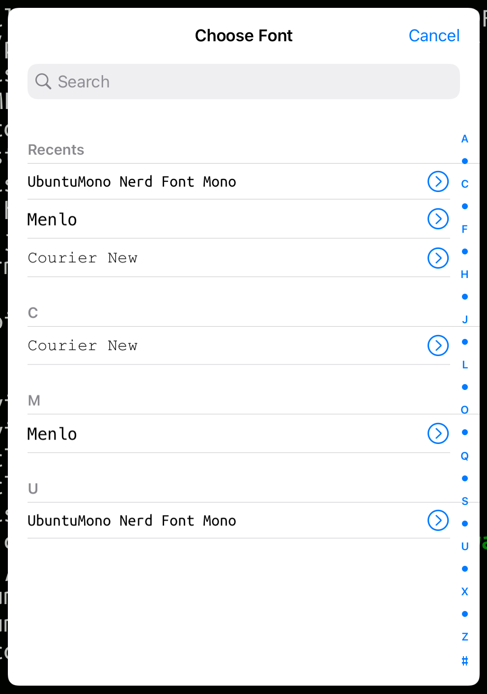
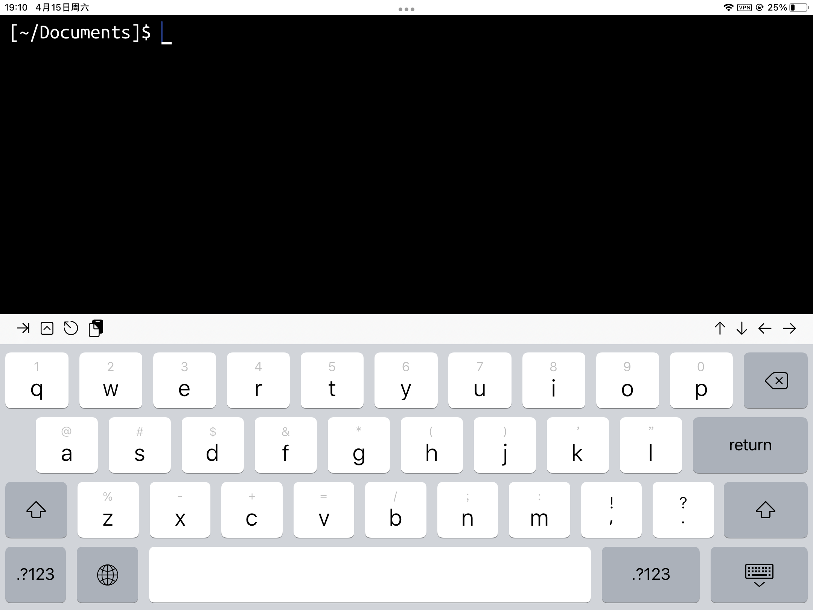
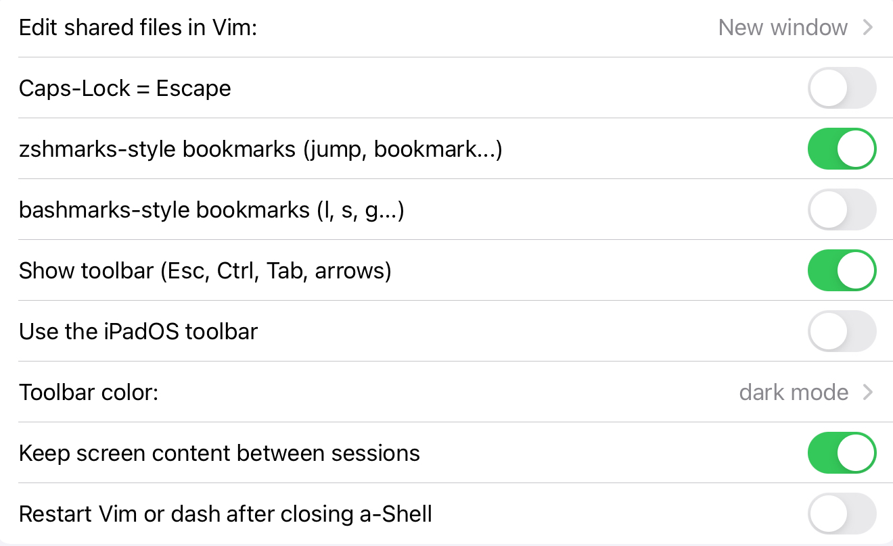

# Configure fonts, colors and the toolbar

`config` command is provided to allow users to configure the fonts, the color of the text and the background, and the toolbar.

### In a word

```
usage: config [-s font size][-n font name][-b background color][-f foreground 
color][-c cursor color][-k shape][-dgprth]
```

* `-s font size`: change the size of the text
* `-n font name`: change the font
* `-b background color`: change the background color
* `-f foreground color`: change the text color
* `-c cursor color`: change the color of the cursor
* `-k shape`: change the shape of the cursor, where `shape` can be beam, block or underline

For commands above, `default` can be used to return to the status stored before, and `factory` can be used to go back to the factory status.

* `-d`: do not save the changes and go back to the precious status
* `-g`: apply the change to all the open windows
* `-p`: save the change to apply it permanently
* `-r`: go back to the initial status: white background and black text
* `-t`: generate a toolbar configuration file
* `-h`: print the help text

### Font

First you have to prepare your own console font manually. It’s recommended to use a nerd font from [https://www.nerdfonts.com](https://www.nerdfonts.com), which includes various icons. Download a font file to your device, then use an App like iFonts to have it installed.

In this example, we’ll use `UbuntuMono Nerd Font Mono`. Go back to a-Shell and just run:

```
$ config -n ‘UbuntuMono Nerd Font Mono’
```

If you don’t know the name of your font, use `config -n` to open a font menu and choose one then.

<figure><figcaption><p>The font menu</p></figcaption></figure>

### Color

You may want a terminal with a black background and white/green text. Let’s run:

```
$ config -b black -f white -c white
```

Use any other colors if you like.

Then save all the settings:

```
$ config -gp
```

Sometimes it looks like:

<figure><figcaption><p>The status bar and keyboard is stIll whIte</p></figcaption></figure>

Wait, why there is still somewhere not dark as the background? These two places are only dark when the device is in dark mode. If you want those to keep light or dark, you can configure it on the Settings App. Start Settings, and you’ll find “a-Shell” at the left menu. Now you see the settings of a-Shell:

<figure><figcaption><p>The setting menu of a-Shell</p></figcaption></figure>

Click “toolbar color”, and you will find four options: `system settings`, `depends on screen color`, `dark mode` and `light mode`. Just choose the one you prefer.

### Toolbar

The buttons of the toolbar at the bottom of the screen is also customizable. First, generate a toolbar configuration file:

```
$ config -t
I have created a toolbar configuration file: ~/Documents/.toolbarDefinition
You can now edit it to add or remove buttons to the toolbar.
Changes will take effect when the app restarts.
```

Then you can edit `.toolbarDefinition` by Vim or Pico. Let‘s see what the file consists of:

```
# Button icon           action          parameter
arrow.right.to.line.alt insertString    \u{0009}
chevron.up.square       systemAction    control
escape                  insertString    \u{001B}
doc.on.clipboard        systemAction    paste
separator
arrow.up                systemAction    up
arrow.down              systemAction    down
arrow.left              systemAction    left
arrow.right             systemAction    right
```

The file is divided into lines, and each line defines a button. There are two parts of it, respectively managing the left and the right end of the toolbar, separated by `separator`.&#x20;

There are three parts of each line: `icon`, `action` and `parameter`. Icons can be a symbol of SF Symbols or a string of characters. For an introduction of SF Symbols, see: [https://developer.apple.com/sf-symbols/](https://developer.apple.com/sf-symbols/), actions can be `insertString`, `systemAction` or `insertCommand`, and parameters defines what to do exactly.&#x20;

`insertString` is to insert a string when pressing the button. At this time, the parameter is the string to be inserted. Special characters like `\n` or `\u{0009}` are supported so keys like Escape are not hard to add. On the contrary, the parameter of `systemAction` can be one of `up`, `down`, `left`, `right`, `control`, `cut`, `copy` or `paste`, and the parameter of `insertCommand` can be a short command. At this time, the output of the command would be inserted at the cursor position.

On iOS/iPadOS 16, when “Use the iOS/iPadOS toolbar” is enabled on the Settings App, buttons can be grouped with brackets. They can be organized conveniently and be configured when to be displayed.&#x20;

Here are some examples included in the generated file:

```
# Example buttons:
#
# delete.backward       insertString    \u{007F}
# return                insertString    \u{000D}
# switch.2              insertString    vim .toolbarDefinition\n
# calendar.badge.clock  insertCommand   date "+%Y_%m_%d"

# Example groups (only with iPads and iOS-style toolbar). Max 15 commands in a submenu
# [
#     scissors                      systemAction    cut
#     arrow.up.doc.on.clipboard     systemAction    copy
#     doc.on.clipboard              systemAction    paste
# ] filemenu.and.cursorarrow

# This one is shown only if no commands are running:
# [="none"
#     ls            insertString    ls -a ~/Documents/
#     uname         insertString    uname -a
#     ping 🍎       insertString    ping www.apple.com
#     date          insertString    date
# ]

# This one appears if you edit a Markdown file in Vim:
# [="vim .*\.md"
#     key               insertString    \u{001B}:q!\n
#     bold              insertString    :s/\\%V.*\\%V./**&**\n
#     italic            insertString    :s/\\%V.*\\%V./*&*\n
#     strikethrough     insertString    :s/\\%V.*\\%V./\\~\\~&\\~\\~\n
# ] contextualmenu.and.cursorarrow
```

