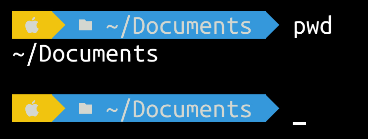

# Configure the Shell

This article focus on configuring the shell of a-Shell. The default (and the only) shell on a-Shell is not `bash`, but `dash`. There are differences between a-Shell’s default shell (the shell you see when you start the App) and `dash` (the shell to execute scripts) and you can run `dash` to see how `dash` works.

### Why dash?

It’s a hard work to include a shell on a-Shell. Among the various shells we can choose, `dash` is a simpler and lighter one.

Although `bash` is used more commonly, it can‘t be included in a-Shell, because it’s under GPL. `zsh` is much more complex, but it’s on the to-do list. If it can be included successfully, the user’s experience would be greatly improved.

### Execute scripts

As `dash` is POSIX-compatible, standard shell scripts are able to be executed. But one thing should be noticed: a number of scripts relies on `bash` actually. The first lines of some scripts is not `/usr/bin/env sh` but `/usr/bin/env bash`, making it not work, even including original `neofetch`. You can try to change `bash` to `dash` or `sh`, but all scripts using the features of `bash` won’t work anyway. In many cases you have to rewrite the script to avoid that. This may be improved if `zsh` can be added in the future.

### .profile and .bashrc

`~/Documents/.profile` and `~/Documents/.bashrc` are provided to let you define what to do when the shell starts. When a new a-Shell window start, both `~/Documents/.profile` and `~/Documents/.bashrc` are loaded, and when `dash` starts, only `~/Documents/.profile` is loaded. That’s the difference between them. You can add many things to the two scripts: environment variables, alias, the prompt, etc. For example, add a alias to your `.profile`:

```bash
alias md=‘mkdir’
```

### Define the prompt

Zsh lovers may be addicted to the colorful prompts of the terminal. The good news is that you can also change what the prompt looks like on a-Shell, but it’s not as easy as how you “set a theme” on `zsh` or `fish`.

What the prompt looks like is defined by the variable `$PS1`. For example, you can set it to a character you like:

```bash
$ export PS1=‘>’
>
```

Sometimes we want to know the current path or other useful information via the prompt. Here are some parameters you can use:

* `\d`: the current date
* `\u`: the username stored at `$USERNAME`, `mobile` by default
* `\s`: the shell’s name
* `\n`: the end of a line, used to start a new line
* `\t`: the current time, going by hh:mm:ss and 24-hour format
* `\T`: the current time, going by hh:mm:ss and 12-hour format
* `\@`: the current time, going by hh:mm and 12-hour format
* `\A`: the current time, going by hh:mm and 24-hour format
* `\v`: the current version of a-Shell
* `\V`: the current version and build number of a-Shell
* `\w`: the current complete path
* `\W`: the current working dictionary, not the complete path
* `\!` and `\#`: the number of the command, not working correctly now
* `\$`: judge if the account is `root`, `#` if yes while `$` if no (it won’t be yes even if you‘ve jailbroken)
* `\\`: a backslash
* `\[` and `\]`: start or stop a place of non-printed characters, which is used to define controlling characters like changing the color

You can use ANSI controlling characters to define colors or other styles. Here is an example:

```
$ export PS1=‘\[\033[034m\]\w\[\033[0m\]\$’
```

Now guess how to get a rainbow-style prompt like this. Nerd fonts will be needed for arrays.

<figure><figcaption><p>A rainblw-style prompt</p></figcaption></figure>

Attention this feature only works for a-Shell’s default shell (the one when a-Shell starts) but not for `dash`. When you run `dash`, you can only get a series of strange codes.

You may want to add a command to the variable like `` `pwd` ``. However, it doesn’t work with a-Shell, so you can’t see `git status` on the prompt.
