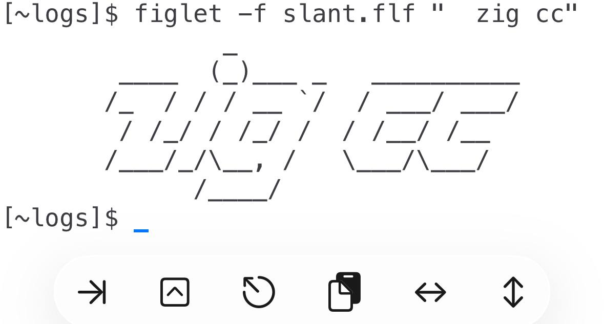

# WebAssembly for a-Shell


This article is unstable.


### What is WebAssembly and how it works with a-Shell?

Due to Apple's safety policy, external binary codes outside of the app itself are forbidden to run. Thus theoretically there won't be a compiler for iOS/iPadOS that we can run and test the codes generated by it conveniently. What C/C++ compiler inside both a-Shell and Code App generates are not iOS/iPadOS native binary files but WebAssembly object codes. With the WebAssembly runtime environment, we can test the codes we write. But what is WebAssembly and why it's chosen to work with the C/C++ compiler?

As the speed of JavaScript is slow, some people hope there can be a technology that can introduce low-level program languages to the web browser, thus WebAssembly is born. It seems to be a kind of new "programming language" but actually it's a kind of object code that can be executed on different architectures and systems, and it's well-known for its safety and efficiency.

As some people have noticed WebAssembly's features, they guess it can be used to write cross-platform projects. Thus, there should be a runtime like Java to provide a way to run WebAssembly codes outside of the browser, which is called `wasi` later. WASI itself can be ported to any platforms and it provides a set of APIs for wasm programs. In a word, when a program claims it supports WebAssembly, it may be designed for two cases: either browser environments, or a kind of cross-platform runtime called `wasi`. When a program works with `wasi`, it can certainly be ported to a-Shell.

WASI built-in with a-Shell is specialized. standard `wasi-libc` only allows WebAssembly programs to read from the standard input and write to the standard output. More system calls like reading and writing files and getting directory contents have been added to a-Shell's WASI, but it still has many limits:

* No process-associated clocks. If you try to compile a program that uses `getrusage()`, there will be an explicit warning telling you to use `-D_WASI_EMULATED_PROCESS_CLOCKS` and `-lwasi-emulated-process-clocks`.
* No signal functions. Again, there will be a warning telling you to use: `-D_WASI_EMULATED_SIGNAL` and link with `-lwasi-emulated-signal`.
* No mmap function. There will be a warning telling you to use: `-D_WASI_EMULATED_MMAN` and link with `-lwasi-emulated-mman`.

There is also no `setjmp()/longjmp()`, no `fork()`, and no threads (and no ways to emulate them. There are threads in some versions of webAssembly, but they require a server, not something running locally).

WASI supports threads experimentally via web workers. For web-based projects, web workers are enabled only when the server has set certain flags. For local side, we don't know how to enable it. Apple has disabled it for security reasons.

The ecosystem of WebAssembly is still embarrassed. As a new-born technology, it has been developed for years but its usage outside of the web browser is still greatly limited.

### Cross compile WebAssembly projects with your computer

You can compile projects to WebAssembly not only with a-Shell's own tool chain, but also with a-Shell's specialized [`wasi-sdk`](https://github.com/holzschu/wasi-sdk), where extra functions like reading or writing files are provided. What's more, normal `wasi-sdk` also works with a-Shell theoretically. See also [the upstream wasi-sdk](https://github.com/WebAssembly/wasi-sdk) for more technical details.

WASI API still continues updating (although VERY SLOW) so new functions may be added in the future in time.

### Cross compile WebAssembly with Zig

Alternatively, you can use the Zig toolchain for building C applications for a-Shell. It's small (around 50 MB on Linux and macOS, 100 MB on Windows), and contains (almost) everything you need [from the start](https://ziglang.org/download/). All commands tested with Zig 0.16.0.

For example, let's build the [`par` application](https://bitbucket.org/amc-nicemice/par/), a little text formatter similar to `fmt`. Cross compiling it to a-Shell is as easy as:

```sh
zig cc --target=wasm32-wasi -fno-sanitize=undefined -o par.wasm *.c
```

In this command we use `zig cc`, a drop-in C compiler bundled with Zig. We set the cross-compilation target to `wasm32-wasi` and disable Zig sanitizers with `-fno-sanitize=undefined` - they can crash old programs at runtime and make our binary bigger. With `-o` we can set the name for the application and with `*.c` we say that we want to compile all C files in the current directory. After this we will get the `par.wasm` application that we can use in a-Shell.

#### Using wasi-libc with Zig

If we try to use the same approach for a different application, for example [`figlet`](https://github.com/cmatsuoka/figlet), we run into the limitations of the standard `wasi-libc`.

```console
$ zig cc --target=wasm32-wasi -fno-sanitize=undefined -Dunix -o figlet.wasm figlet.c zipio.c crc.c inflate.c
...
wasm-ld: error: undefined symbol: tmpfile
```

Notice that we don't use all C files for the build, because we don't need them, and set `-Dunix` because `figlet` needs this definition to choose the right includes. However, we still have a problem - there is no `tmpfile` function in libc for wasm. But we have it in [a-Shell's specialized `wasi-libc`](https://github.com/holzschu/wasi-libc).

After you build it, you need to describe a new C library for Zig. Use `zig libc > wasi-libc.txt` to get a template with comments. In this file you need to set paths to the `wasi-libc` you built like this (all comments have been stripped for clarity):

```ini
include_dir=/path/to/wasi-libc/sysroot/include/wasm32-wasip1
sys_include_dir=/path/to/wasi-libc/sysroot/include/wasm32-wasip1
crt_dir=/path/to/wasi-libc/sysroot/lib/wasm32-wasip1
msvc_lib_dir=
kernel32_lib_dir=
gcc_dir=
```

Don't forget to replace `/path/to` in this file with the absolute path to your `wasi-libc`.

After this you can point Zig to this file via the `ZIG_LIBC` environment variable like this:

```sh
ZIG_LIBC=../wasi-libc/wasi-libc.txt zig cc --target=wasm32-wasi -fno-sanitize=undefined -Dunix -o figlet.wasm figlet.c zipio.c crc.c inflate.c
```

Copy `figlet.wasm` into your a-Shell and don't forget to bring a font file with you.

<figure><figcaption><p>figlet in a-Shell</p></figcaption></figure>

### `wasm3` with a-Shell

There is also a command `wasm3` shipped with a-Shell. `wasm3` may behave better than `wasm` in some ways but it's more limited in memory allocation. Try it out just replacing `wasm` with `wasm3`.

```
$ wasm3 your_program.wasm
```

### Any idea of Wasmer and Wasix?

We are currently working at them.
